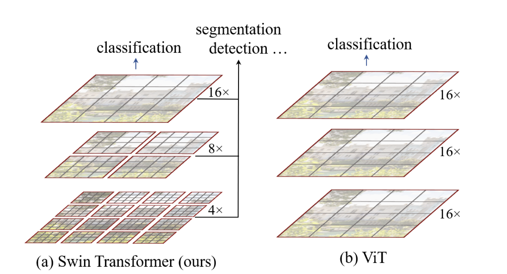
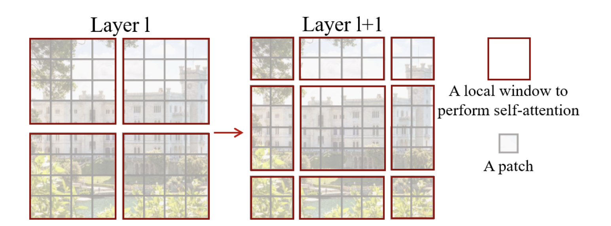
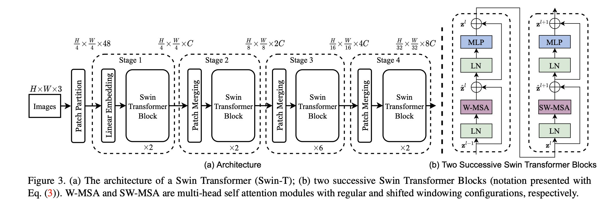

# Swin Transformer on CIFAR-10

<hr>

## Contents

1. [Highlights](#Highlights)
2. [Requirements](#Requirements)
3. [Usage](#Training)
4. [Results](#Results)


<hr>

## Highlights
This project is a implementation from scratch of a slightly modified version of the Swin transformer introduced in the paper [Swin Transformer: Hierarchical Vision Transformer using Shifted Windows](https://arxiv.org/abs/2103.14030). We implement this model on the small scale benchmark dataset `CIFAR-10`. 

**Swin Transformer** (the name `Swin` stands for **S**hifted **win**dow) is initially described in [arxiv](https://arxiv.org/abs/2103.14030), which capably serves as a general-purpose backbone for computer vision. It is basically a hierarchical Transformer whose representation is computed with shifted windows. The shifted windowing scheme brings greater efficiency by limiting self-attention
computation to non-overlapping local windows while also allowing for cross-window connection.

The proposed Swin Transformer builds hierarchical feature maps by merging image patches (shown in gray) in deeper layers and has linear computation complexity to input image size due to computation of self-attention only within each local window (shown in red). It can thus serve as a general-purpose backbone for both image classification and dense recognition tasks. In contrast, previous vision Transformers produce feature maps of a single low resolution and have quadratic computation complexity to input image size due to computation of self-attention globally.

</img>

Swin departs from the traditional method of computing self-attention and implements a shifted window approach for computing self-attention. In layer $l$ (left), a regular window partitioning scheme is adopted, and self-attention is computed within each window. In the next layer $l+1$ (right), the window partitioning is shifted, resulting in new windows. The self-attention computation in the new windows crosses the boundaries of the previous windows in layer $l$, providing connections among them. 

</img>

The overall architecture of the Swin model can be seen below:

</img>

This project focuses on implementing Swin on an image classification task and shows that with modifications, supervised training of the Swin transformer model on small scale datasets like `CIFAR-10` can lead to very high accuracy with low computational constraints. The shifted-window attention block can be seen here:


```python
class ShiftedWindowAttention(nn.Module):
    def __init__(self, dim, head_dim, shape, window_size, shift_size=0):
        super().__init__()
        self.heads = dim // head_dim
        self.head_dim = head_dim
        self.scale = head_dim**-0.5

        self.shape = shape
        self.window_size = window_size
        self.shift_size = shift_size

        self.to_qkv = nn.Linear(dim, dim * 3)
        self.unifyheads = nn.Linear(dim, dim)

        self.pos_enc = nn.Parameter(torch.Tensor(self.heads, (2 * window_size - 1)**2))
        self.register_buffer("relative_indices", self.get_indices(window_size))

        if shift_size > 0:
            self.register_buffer("mask", self.generate_mask(shape, window_size, shift_size))


    def forward(self, x):
        shift_size, window_size = self.shift_size, self.window_size

        x = self.to_windows(x, self.shape, window_size, shift_size) # partition into windows

        # self attention
        qkv = self.to_qkv(x).unflatten(-1, (3, self.heads, self.head_dim)).transpose(-2, 1)
        queries, keys, values = qkv.unbind(dim=2)

        att = queries @ keys.transpose(-2, -1)

        att = att * self.scale + self.get_rel_pos_enc(window_size) # add relative positon encoding

        # masking
        if shift_size > 0:
            att = self.mask_attention(att)

        att = F.softmax(att, dim=-1)

        x = att @ values
        x = x.transpose(1, 2).contiguous().flatten(-2, -1) # move head back
        x = self.unifyheads(x)

        x = self.from_windows(x, self.shape, window_size, shift_size) # undo partitioning into windows
        return x


    def to_windows(self, x, shape, window_size, shift_size):
        x = x.unflatten(1, shape)
        if shift_size > 0:
            x = x.roll((-shift_size, -shift_size), dims=(1, 2))
        x = self.split_windows(x, window_size)
        return x


    def from_windows(self, x, shape, window_size, shift_size):
        x = self.merge_windows(x, shape, window_size)
        if shift_size > 0:
            x = x.roll((shift_size, shift_size), dims=(1, 2))
        x = x.flatten(1, 2)
        return x


    def mask_attention(self, att):
        num_win = self.mask.size(1)
        att = att.unflatten(0, (att.size(0) // num_win, num_win))
        att = att.masked_fill(self.mask, float('-inf'))
        att = att.flatten(0, 1)
        return att


    def get_rel_pos_enc(self, window_size):
        indices = self.relative_indices.expand(self.heads, -1)
        rel_pos_enc = self.pos_enc.gather(-1, indices)
        rel_pos_enc = rel_pos_enc.unflatten(-1, (window_size**2, window_size**2))
        return rel_pos_enc


    @staticmethod
    def generate_mask(shape, window_size, shift_size):
        region_mask = torch.zeros(1, *shape, 1)
        slices = [slice(0, -window_size), slice(-window_size, -shift_size), slice(-shift_size, None)]

        region_num = 0
        for i in slices:
            for j in slices:
                region_mask[:, i, j, :] = region_num
                region_num += 1

        mask_windows = ShiftedWindowAttention.split_windows(region_mask, window_size).squeeze(-1)
        diff_mask = mask_windows.unsqueeze(1) - mask_windows.unsqueeze(2)
        mask = diff_mask != 0
        mask = mask.unsqueeze(1).unsqueeze(0) # add heads and batch dimension
        return mask


    @staticmethod
    def split_windows(x, window_size):
        n_h, n_w = x.size(1) // window_size, x.size(2) // window_size
        x = x.unflatten(1, (n_h, window_size)).unflatten(-2, (n_w, window_size)) # split into windows
        x = x.transpose(2, 3).flatten(0, 2) # merge batch and window numbers
        x = x.flatten(-3, -2)
        return x


    @staticmethod
    def merge_windows(x, shape, window_size):
        n_h, n_w = shape[0] // window_size, shape[1] // window_size
        b = x.size(0) // (n_h * n_w)
        x = x.unflatten(1, (window_size, window_size))
        x = x.unflatten(0, (b, n_h, n_w)).transpose(2, 3) # separate batch and window numbers
        x = x.flatten(1, 2).flatten(-3, -2) # merge windows
        return x


    @staticmethod
    def get_indices(window_size):
        x = torch.arange(window_size, dtype=torch.long)

        y1, x1, y2, x2 = torch.meshgrid(x, x, x, x, indexing='ij')
        indices = (y1 - y2 + window_size - 1) * (2 * window_size - 1) + x1 - x2 + window_size - 1
        indices = indices.flatten()

        return indices
```

<hr>

## Requirements
```shell
pip install -r requirements.txt
```

<hr>

## Usage
To replicate the reported results, clone this repo
```shell
cd your_directory git clone git@github.com:jordandeklerk/SwinViT-pytorch.git
```
and run the main training script
```shell
python train.py 
```

<hr>

## Results
We test our approach on the `CIFAR-10` dataset with the intention to extend our model to 4 other small low resolution datasets: `Tiny-Imagenet`, `CIFAR100`, `CINIC10` and `SVHN`. All training took place on a single V100 GPU.
  * CIFAR10
    * ```swin_cifar10_patch2_input32``` - 91.10 @ 32

<hr>

## Citation
```bibtex
@article{liu2021Swin,
  title={Swin Transformer: Hierarchical Vision Transformer using Shifted Windows},
  author={Liu, Ze and Lin, Yutong and Cao, Yue and Hu, Han and Wei, Yixuan and Zhang, Zheng and Lin, Stephen and Guo, Baining},
  booktitle={Proceedings of the IEEE/CVF International Conference on Computer Vision (ICCV)},
  year={2021}
}
```
